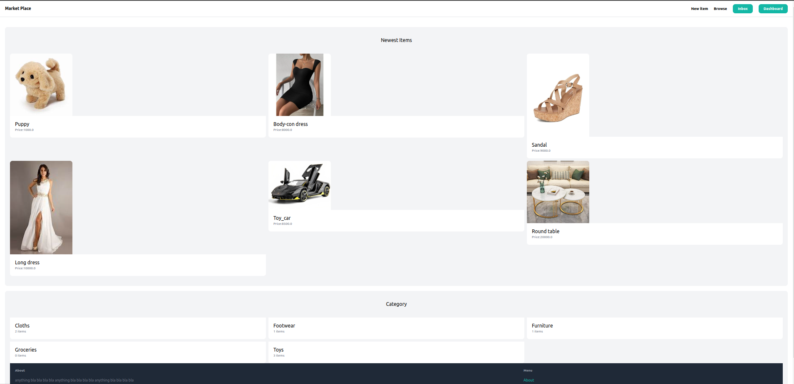
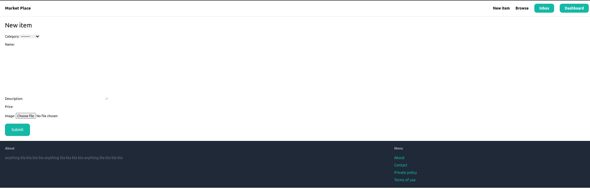
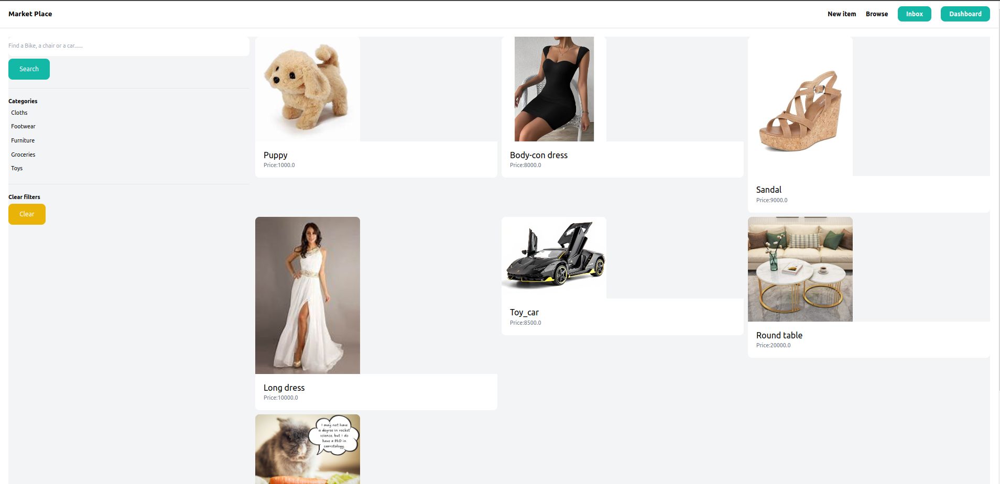
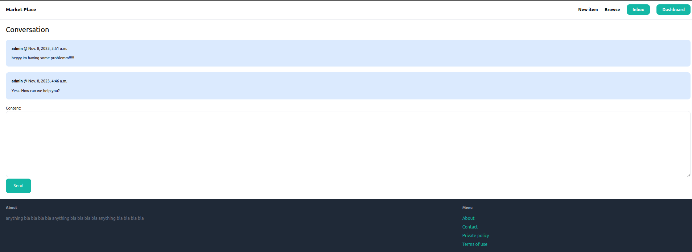

# Online Shopping App

## Introduction

This is a Django-based online shopping app with a range of features to provide a seamless shopping experience. It includes user authentication, a user dashboard, customer care communication, item uploading, item searching, a beautiful UI, and additional pages like the user profile and user feed.

## Features

- **User Authentication**: Secure user authentication system to protect user accounts and data.
- **Dashboard**: A personalized dashboard for users to manage their activities and view relevant information.
- **Customer Care Communication**: Integrated customer care system for easy communication and issue resolution.
- **Item Management**: Users can upload items for sale, and the app supports efficient item searching.
- **UI Design**: A visually appealing and user-friendly interface for an enhanced shopping experience.
- **Profile Page**: Individual user profiles to showcase personal information and order history.
- **User Feed Page**: A feed page to keep users updated on the latest products or activities.

## Screenshots

### Dashboard

<p>
  
</p>

### Item Upload

<p>
  
</p>

### Item Search
<p>
  
</p>

### Customer Care

<p>
  
</p>

## Getting Started

Follow these steps to set up and run the project locally:

1. Clone the repository:

   ```bash
   git clone git@github.com:pg321/Shop_Ease_App-on-Django-Framework.git
   cd Shop-Ease-app
   ```

2. Installed Dependencies:
  
    ```shell
    pip install -r requirements.txt
    ```
3.  Run migrations:
  
    ```shell
    python manage.py migrate
    ```

2. Start the development server:
  
    ```shell
    python manage.py runserver
    ```
